# AgenticMath - 工作流程視覺化圖表

**版本**: 1.0
**最後更新**: 2025-11-09

本文件提供 AgenticMath 系統的視覺化流程圖，使用 Mermaid 語法繪製。

---

## 📊 完整系統架構圖

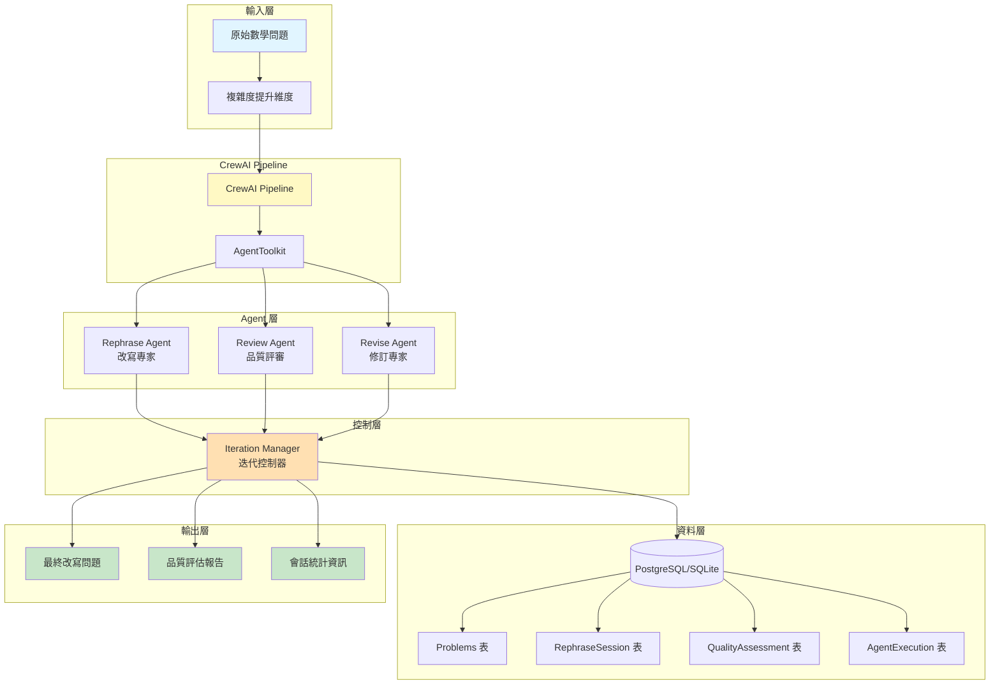

---

## 🔄 完整執行流程圖

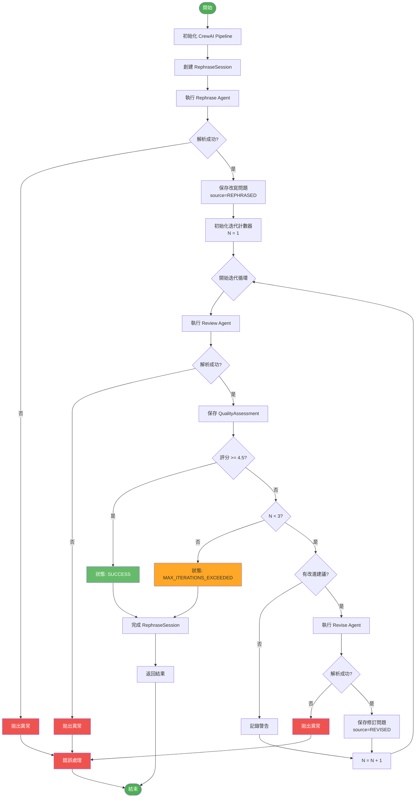

---

## 🎯 狀態機圖（RephraseSession）

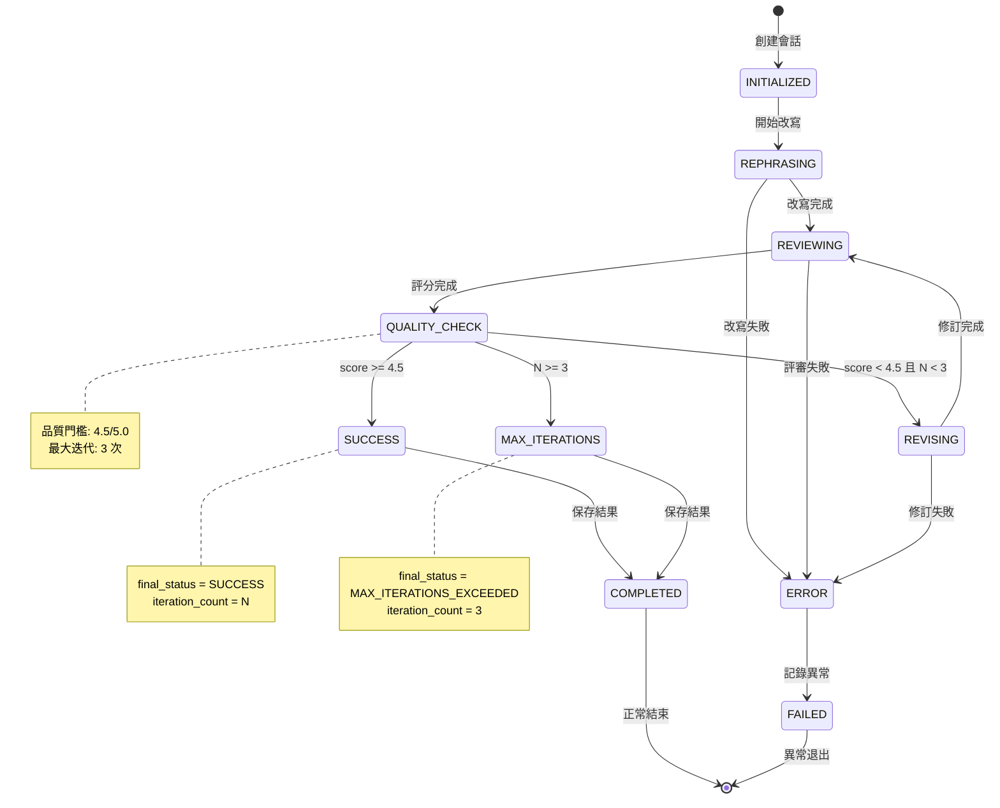

---

## 🔁 迭代循環詳細流程

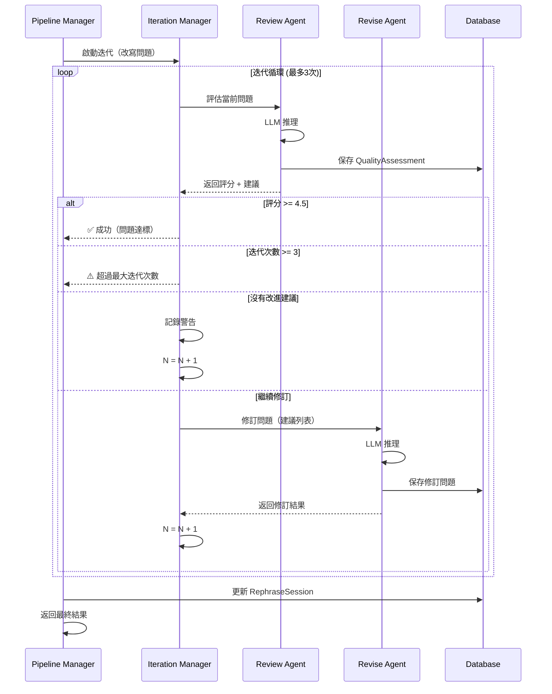

---

## 📦 資料模型關聯圖

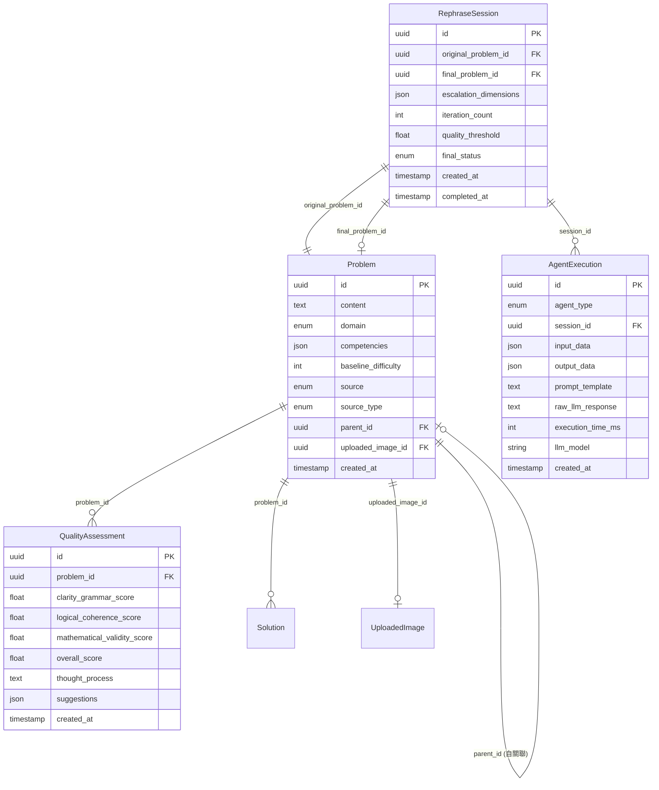

---

## 🧩 Agent 協作時序圖

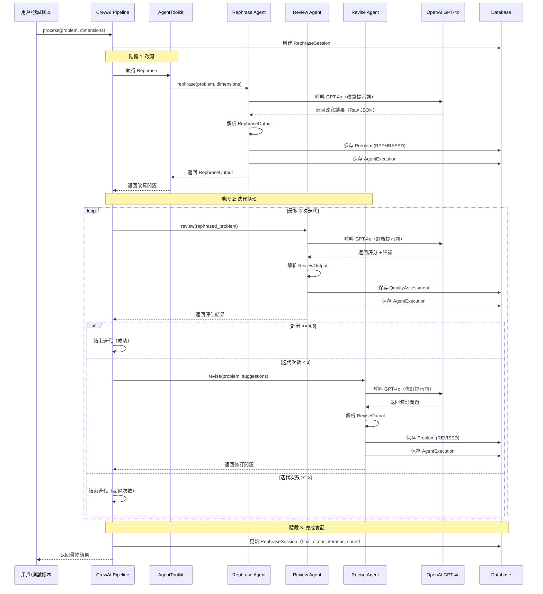

---

## 🎨 複雜度提升維度應用流程

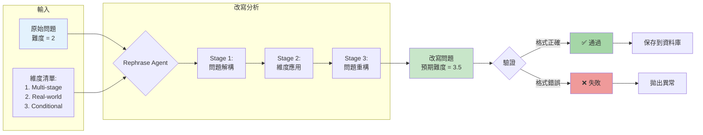

---

## 📊 品質評分流程圖

```mermaid
flowchart TD
    Start[開始評審] --> Input[接收改寫問題]

    Input --> Analyze[分析三個維度]

    Analyze --> Clarity[評估文法與清晰度<br/>score_1 = 1.0-5.0]
    Analyze --> Logic[評估邏輯連貫性<br/>score_2 = 1.0-5.0]
    Analyze --> Math[評估數學有效性<br/>score_3 = 1.0-5.0]

    Clarity --> Aggregate[計算整體評分]
    Logic --> Aggregate
    Math --> Aggregate

    Aggregate --> Overall[overall_score =<br/>avg score_1, score_2, score_3]

    Overall --> CheckThreshold{score >= 4.5?}

    CheckThreshold -->|是| Pass[✅ 通過<br/>無需修訂]
    CheckThreshold -->|否| Suggestions[生成改進建議清單]

    Pass --> SavePass[保存評估<br/>suggestions = []]
    Suggestions --> SaveFail[保存評估<br/>suggestions = [建議1, 建議2...]]

    SavePass --> Return[返回評估結果]
    SaveFail --> Return

    Return --> End[結束]

    style Pass fill:#66bb6a,color:#fff
    style Suggestions fill:#ffa726
```

---

## 🔧 LLM API 呼叫與重試流程

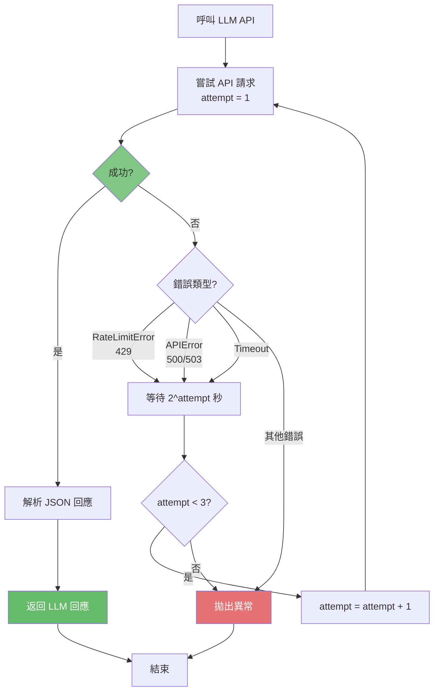

---

## 📈 測試執行流程圖

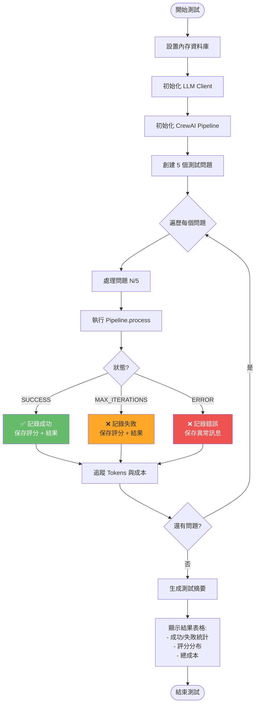

---

## 🗂️ 資料流轉示意圖

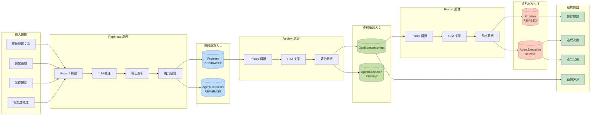

---

## 🎭 Agent 角色互動圖

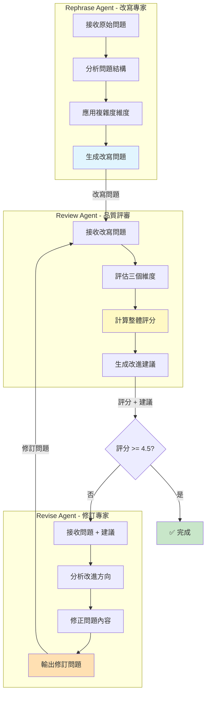

---

**文件結束**

這些圖表可以在支援 Mermaid 的環境中渲染，例如：
- GitHub Markdown
- GitLab Markdown
- VS Code (with Mermaid extension)
- Obsidian
- Mermaid Live Editor (https://mermaid.live)
